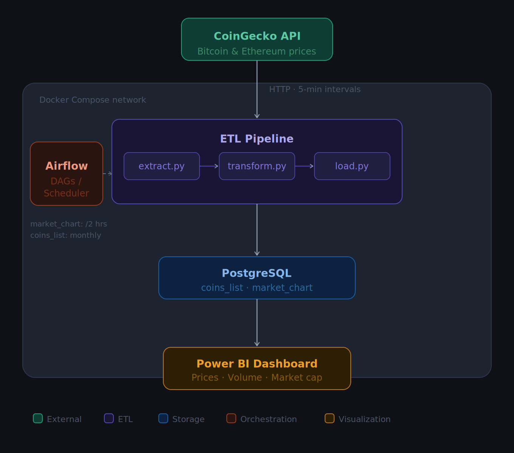

# Crypto Data Pipeline

An end-to-end data pipeline that collects cryptocurrency price data from CoinGecko, stores it in PostgreSQL, orchestrates the workflow with Apache Airflow, and visualizes insights through a Power BI dashboard.

---

## Table of Contents

- [Overview](#overview)
- [Architecture](#architecture)
- [Project Structure](#project-structure)
- [Tech Stack](#tech-stack)
- [ETL Process](#etl-process)
- [Airflow DAGs](#airflow-dags)

---

## Overview

This project builds a data pipeline that:

1. Pulls **5-minute interval** crypto price data (Bitcoin & Ethereum) from the [CoinGecko API](https://www.coingecko.com/en/api)
2. Stores the data in a **PostgreSQL** database
3. Orchestrates the pipeline using **Apache Airflow** (scheduled runs every 2 hours)
4. Visualizes price trends, trading volume, and market cap through a **Power BI** dashboard

---

## Architecture




---

## Project Structure

```
crypto-data-pipeline/
│
├── docker-compose.yaml       # Defines all services (PostgreSQL, pgAdmin, MinIO, Airflow)
├── Dockerfile                # Builds the Python ETL pipeline image
├── init.sql                  # Initializes the database, user, and tables on first run
├── requirements.txt          # Python dependencies
├── coins.txt                 # List of coin IDs to scrape (one per line)
├── .gitignore
│
├── dags/
│   ├── coins_list.py         # Airflow DAG: monthly full refresh of coins master list
│   └── market_chart.py       # Airflow DAG: scheduled crypto price scraping (every 2 hours)
│
└── src/
    ├── __init__.py
    ├── etl.py                # Entry point — runs the pipeline (accepts CLI args)
    ├── extract.py            # Pulls data from CoinGecko API
    ├── transform.py          # Reshapes raw API response into DataFrames
    ├── load.py               # Loads DataFrames into PostgreSQL
    └── utils.py              # Shared helpers: send_request(), get_engine(), constants
```

---

## Tech Stack

| Layer | Technology |
|---|---|
| Data Source | CoinGecko API |
| Language | Python |
| ETL | pandas, requests, SQLAlchemy, psycopg2 |
| Database | PostgreSQL 17 |
| Orchestration | Apache Airflow 2.10.5 (Local Executor) |
| Containerization | Docker & Docker Compose |
| Visualization | Power BI |

---

## ETL Process

The pipeline is split into three stages, each handled by a dedicated module inside `src/`.

**Extract** (`extract.py`) sends HTTP GET requests to the CoinGecko API using the coin IDs listed in `coins.txt`. It fetches two types of data: the full coins master list and the historical market chart for each coin. The market chart endpoint returns prices, market caps, and total volumes at 5-minute intervals when queried with `days=1`.

**Transform** (`transform.py`) takes the raw JSON response from the market chart endpoint and reshapes it into a single pandas DataFrame. The three components of the response (prices, market caps, total volumes) are each converted into their own DataFrame and then merged on the timestamp column. Unix timestamps are converted to human-readable datetime values and a `coin_id` column is added to identify the source coin.

**Load** (`load.py`) handles writing data to PostgreSQL via SQLAlchemy. For the coins master list, a full load strategy is used — the table is truncated before each run and reloaded with the latest data. For the market chart table, an incremental load strategy is used — before inserting, the pipeline checks the latest timestamp already present in the database for that coin and only loads records newer than that, preventing duplicate entries.

The entry point `etl.py` accepts a CLI argument (`coins_list` or `market_chart`) to control which pipeline runs, making it easy for Airflow to trigger each independently.

---

## Airflow DAGs

Both DAGs use the **DockerOperator** to run the `crypto_scraper` image, keeping the pipeline logic fully contained and independent from the Airflow environment. They share the same Docker network as the PostgreSQL container (`app_default`) so the ETL container can reach the database by service name.

**`market_chart.py`** runs on a schedule of every 2 hours (`0 */2 * * *`). Each run pulls the latest 5-minute interval price data for all coins in `coins.txt` and performs an incremental load into the `market_chart` table.

**`coins_list.py`** runs on the first day of every month (`0 0 1 * *`). It performs a full refresh of the `coins_list` table, truncating it and reloading the complete list of coins available on CoinGecko.

Both DAGs have `catchup=False` to prevent Airflow from backfilling missed runs, and logs from each execution are accessible through the Airflow UI via the Graph view.
